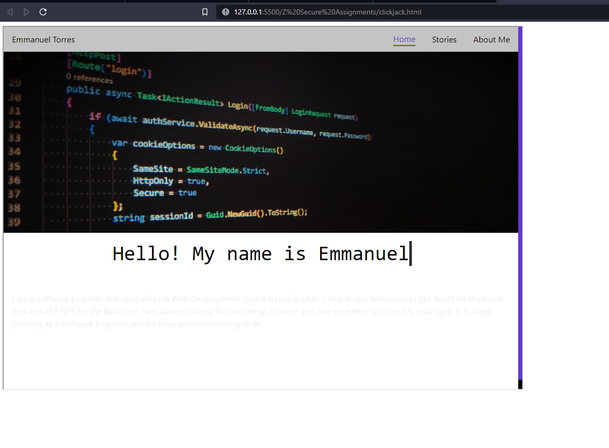
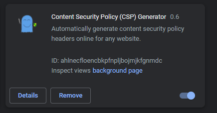
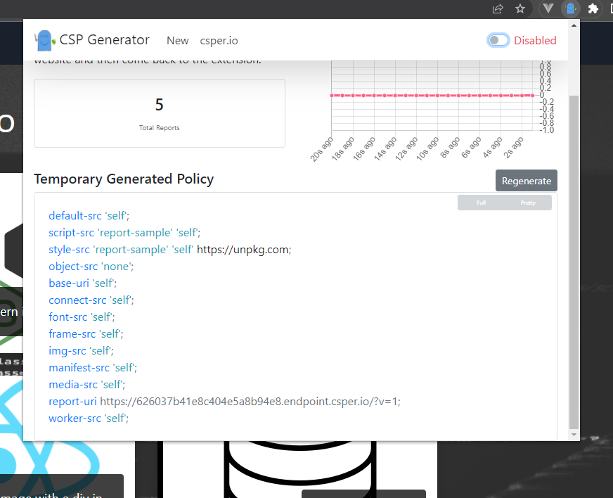
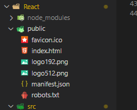
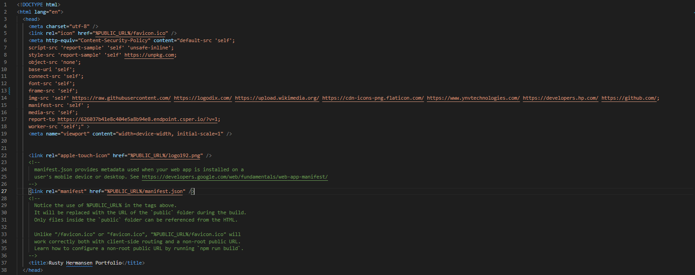

When it comes to writing web pages in React, it is a pretty secure framework. If you try cross site scripting attacks you are generally met with disappointment because it guards against them out of the box. It does, however have other vulnerabilities. One of those vulnerabilities I managed to find just messing around with different types of attacks that web pages may be vulnerable to. Lo and behold, I found one, clickjacking. The clickjacking attack that I found my own portfolio was vulnerable to is one where you can give an iframe source your URL and your page will render in the iframe. You may be wondering why this may be bad, this is bad because someone can take your url and make a new one that is so similar that it is feasible that it could be your URL. They can render your page in an iframe, overlay a new link over one of your buttons or links, clone something like a login page, and start skimming login login credentials. Below is an example of some code that can be used to perform a clickjacking attack to a vulnerable page. 

``` html
<style>
    iframe {
        position: relative;
        width: 1000px;
        height: 700px;
        z-index: 1;
    }
    a {
        position: absolute;
        top: 440px;
        left: 470px;
        opacity: .00001;
        z-index:2;
    }   
</style>
<HTML>
<HEAD>

    <TITLE>ClickJack'd!</TITLE>

</HEAD>
<BODY BGCOLOR="FFFFFF">
    <iframe src="https://emmanueltorreshn.com"></iframe>
    <a href="https://rustyhermansensoftwareengineer.link">Link Name</a>
</BODY>
</HTML>
```

Notice in this code how the anchor overlays the iframe and the anchor is given coordinates, this is because you have to position your anchor in just the right spot and make it more or less invisible in order to fool someone. Below is an example of what this code looks like when clickjacking my friend, Emmanuels page:



In order to prevent attacks like these on your page you can employ a content security policy or CSP. The easiest way to get a CSP is to use browser extensions that just require you to navigate to the web page and activate the extension and it will automatically generate a content security policy for you. Since I'm using Chrome I selected the Content Security Policy Generator extension.



Once you have your extension installed now all you need to do is navigate to your web page an have it generate a policy for you. Here is the policy it generated for my web page. It's kind of a generic policy that it creates that requires you to add permissions as needed to have all of your content work and load properly. Here is what the generic generated policy looks like:



Now that I have a policy generated, it's time to put the policy to work. There is more than one way put your policy to work, you can do it in your NGINX conf files if you want if you're using NGINX or you can just put meta tags in the head of your HTML page. Since React is a single page application you really only ever need to worry about putting it in one place, that being between the head tags in the index.html file that lives in the public folder (that is, if you used npx create-react-app *appname* to scaffold your react app for you).



Here is what my code looks like with the content security policy in index.html that lives in my public folder:



You'll notice that I made some changes to mine, these changes were made because I have some images that render from a URL as opposed to living inside of directory for my page. You may very well have to make some of your own changes for your own content security policy. The good news is,  you can use the console in your browser developer tools when you inspect a page in order to determine if your security policy needs some tweaking to make all of your features work. I also added the frame-ancestors 'self' piece on line 12, it is this line specifically that blocks your page from being able to be rendered in an iframe as shown below.


There you have it, a content security policy in place and a page that is more secure than it was before. 